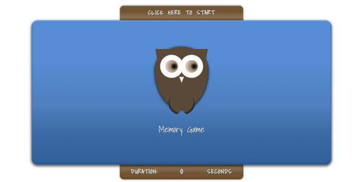
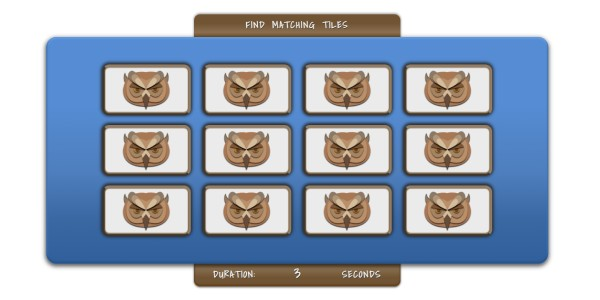
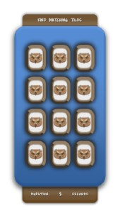

# Memory-Game

The game is designed to learn Java Script and consolidate knowledge about HTML and CSS. The project was created and designed by me. The idea was to create a fully functioning and responsive game.

Desktop 

Mobile

 

## Technologies

* HTML5
* SCSS
* JavaScript

## Link

Here you will find the link to Memory_Game
(https://pawel-serafinko.github.io/Memory-Game/)
